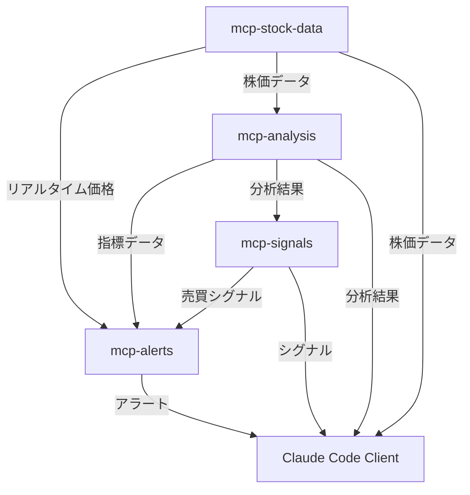

# MCP統合アーキテクチャ設計書

## 概要

Model Context Protocol (MCP) を活用したマイクロサービス型株式取引分析システムの設計書です。Claude Codeから直接アクセス可能な4つの専門MCPサーバを構築し、リアルタイムでの株式データ分析・トレーディング判断支援を提供します。

## アーキテクチャ概要

```
Claude Code (Client)
├── mcp-stock-data     (株価データ配信サーバ)
├── mcp-analysis       (テクニカル分析実行サーバ)
├── mcp-signals        (売買シグナル生成サーバ)
└── mcp-alerts         (アラート・通知サーバ)
```

## MCP サーバ構成

### 1. mcp-stock-data (株価データ配信サーバ)

**責務**: リアルタイム株価データの取得・配信・キャッシュ管理

#### 主要機能
- **リアルタイムデータ取得**: yfinance APIを通じた最新株価データ取得
- **履歴データ管理**: SQLiteベースの効率的なデータストレージ
- **データ正規化**: 日本株・米国株の銘柄コード統一化
- **キャッシュ戦略**: 頻繁にアクセスされるデータの高速配信
- **レート制限管理**: API呼び出し制限の自動管理

#### 提供ツール
```typescript
// データ取得ツール
get_realtime_price(symbol: string) → RealtimePrice
get_historical_data(symbol: string, period: string, interval: string) → HistoricalData
get_multiple_symbols(symbols: string[]) → MultiSymbolData

// データ管理ツール
cache_status() → CacheInfo
clear_cache(older_than_days?: number) → ClearResult
validate_symbol(symbol: string) → SymbolValidation
```

#### データスキーマ
```typescript
interface RealtimePrice {
  symbol: string;
  price: number;
  volume: number;
  change: number;
  changePercent: number;
  timestamp: Date;
  marketStatus: 'open' | 'closed' | 'pre' | 'after';
}

interface HistoricalData {
  symbol: string;
  data: {
    timestamp: Date;
    open: number;
    high: number;
    low: number;
    close: number;
    volume: number;
  }[];
  interval: string;
  period: string;
}
```

### 2. mcp-analysis (テクニカル分析実行サーバ)

**責務**: 高度なテクニカル分析の実行とインジケーター計算

#### 主要機能
- **テクニカル指標計算**: RSI, MACD, ボリンジャーバンド, ATR等の包括的計算
- **サポート・レジスタンス検出**: 自動的な重要価格レベル識別
- **パターン認識**: チャートパターンの自動検出
- **ボラティリティ分析**: 価格変動性の詳細解析
- **トレンド分析**: 短期・中期・長期トレンドの判定

#### 提供ツール
```typescript
// 基本指標計算
calculate_rsi(symbol: string, period?: number) → RSIData
calculate_macd(symbol: string, fast?: number, slow?: number, signal?: number) → MACDData
calculate_bollinger_bands(symbol: string, period?: number, std?: number) → BollingerData
calculate_atr(symbol: string, period?: number) → ATRData

// 高度な分析
detect_support_resistance(symbol: string, timeframe: string) → SupportResistanceLevels
analyze_trend(symbol: string, timeframes: string[]) → TrendAnalysis
calculate_volatility_metrics(symbol: string) → VolatilityMetrics
comprehensive_analysis(symbol: string) → ComprehensiveAnalysis
```

#### 分析結果スキーマ
```typescript
interface ComprehensiveAnalysis {
  symbol: string;
  timestamp: Date;
  technicalIndicators: {
    rsi: number;
    macd: MACDValues;
    bollingerBands: BollingerValues;
    atr: number;
    vwap: number;
  };
  supportResistance: {
    support: PriceLevel[];
    resistance: PriceLevel[];
    pivotPoints: PivotPointData;
  };
  trendAnalysis: {
    shortTerm: TrendDirection;
    mediumTerm: TrendDirection;
    longTerm: TrendDirection;
    strength: number; // 0-100
  };
  volatilityMetrics: {
    currentVolatility: number;
    averageVolatility: number;
    volatilityPercentile: number;
    riskLevel: 'low' | 'medium' | 'high';
  };
}
```

### 3. mcp-signals (売買シグナル生成サーバ)

**責務**: 複合的な売買シグナルの生成とバックテスト実行

#### 主要機能
- **マルチファクターシグナル**: 複数指標を組み合わせた高精度シグナル生成
- **リアルタイムスコアリング**: 0-100スケールでの信頼度評価
- **カスタムルール管理**: ユーザー定義トレーディングルールの実行
- **バックテスト機能**: 履歴データによる戦略検証
- **リスク調整**: ポジションサイズとリスクレベルの最適化

#### 提供ツール
```typescript
// シグナル生成
generate_signals(symbol: string, timeframe?: string) → TradingSignals
get_signal_strength(symbol: string) → SignalStrength
evaluate_entry_conditions(symbol: string, strategy?: string) → EntryEvaluation

// 戦略管理
create_custom_strategy(strategy: StrategyDefinition) → StrategyId
backtest_strategy(strategyId: string, symbol: string, period: string) → BacktestResults
get_strategy_performance(strategyId: string) → PerformanceMetrics

// ポートフォリオ最適化
optimize_portfolio(symbols: string[], capital: number) → PortfolioAllocation
```

#### シグナルスキーマ
```typescript
interface TradingSignals {
  symbol: string;
  timestamp: Date;
  signal: 'BUY' | 'SELL' | 'HOLD';
  strength: number; // 0-100
  confidence: number; // 0-1
  entryPrice: number;
  stopLoss: number;
  takeProfitLevels: number[];
  riskRewardRatio: number;
  reasoning: {
    activeRules: string[];
    technicalFactors: Record<string, number>;
    marketConditions: string;
  };
}

interface BacktestResults {
  strategyId: string;
  symbol: string;
  period: string;
  totalTrades: number;
  winRate: number;
  averageReturn: number;
  maxDrawdown: number;
  sharpeRatio: number;
  profitFactor: number;
  trades: Trade[];
}
```

### 4. mcp-alerts (アラート・通知サーバ)

**責務**: リアルタイムアラート管理と通知配信

#### 主要機能
- **価格アラート**: 指定価格到達時の即座通知
- **シグナルアラート**: 売買シグナル発生時の自動通知
- **ボラティリティアラート**: 異常な価格変動の検知
- **ニュースアラート**: 重要市場ニュースの配信
- **ポートフォリオ監視**: 保有ポジションのリスク監視

#### 提供ツール
```typescript
// アラート管理
create_price_alert(symbol: string, targetPrice: number, condition: 'above' | 'below') → AlertId
create_signal_alert(symbol: string, signalType: 'BUY' | 'SELL') → AlertId
create_volatility_alert(symbol: string, threshold: number) → AlertId

// 通知設定
set_notification_preferences(preferences: NotificationSettings) → void
get_active_alerts() → ActiveAlert[]
delete_alert(alertId: string) → void

// 監視機能
monitor_portfolio(positions: Position[]) → PortfolioStatus
get_market_news(symbols?: string[]) → MarketNews[]
check_alert_triggers() → TriggeredAlert[]
```

#### アラートスキーマ
```typescript
interface Alert {
  id: string;
  type: 'price' | 'signal' | 'volatility' | 'news' | 'portfolio';
  symbol: string;
  condition: AlertCondition;
  isActive: boolean;
  createdAt: Date;
  lastTriggered?: Date;
  notificationChannels: ('console' | 'email' | 'webhook')[];
}

interface TriggeredAlert {
  alertId: string;
  symbol: string;
  message: string;
  severity: 'low' | 'medium' | 'high' | 'critical';
  timestamp: Date;
  currentValue: number;
  targetValue: number;
  actionRecommendation?: string;
}
```

## データフロー設計

### 1. リアルタイムデータフロー

```
mcp-stock-data → mcp-analysis → mcp-signals → mcp-alerts
      ↓               ↓             ↓           ↓
   株価データ      技術分析        シグナル     アラート配信
```

### 2. 相互依存関係



### 3. イベント駆動アーキテクチャ

#### イベントタイプ
```typescript
interface MCPEvent {
  type: 'price_update' | 'signal_generated' | 'alert_triggered' | 'analysis_completed';
  timestamp: Date;
  source: string;
  data: EventData;
}

// 価格更新イベント
interface PriceUpdateEvent extends MCPEvent {
  type: 'price_update';
  data: {
    symbol: string;
    price: number;
    change: number;
    volume: number;
  };
}

// シグナル生成イベント
interface SignalGeneratedEvent extends MCPEvent {
  type: 'signal_generated';
  data: {
    symbol: string;
    signal: 'BUY' | 'SELL';
    strength: number;
    confidence: number;
  };
}
```

## セキュリティ・認証

### 1. API認証
- **JWT トークン**: サーバ間通信の認証
- **API キー管理**: 外部API（yfinance等）のキー管理
- **レート制限**: DDoS攻撃対策

### 2. データセキュリティ
- **データ暗号化**: 保存時・通信時の暗号化
- **アクセス制御**: 機能別のアクセス権限管理
- **監査ログ**: 全API呼び出しのログ記録

## パフォーマンス最適化

### 1. キャッシュ戦略
- **多層キャッシュ**: メモリ・Redis・SQLite
- **TTL管理**: データの鮮度に応じた有効期限設定
- **プリフェッチ**: 予測的なデータ取得

### 2. 並行処理
- **非同期処理**: I/O集約的タスクの並行実行
- **ワーカープール**: CPU集約的計算の分散処理
- **イベントループ**: リアルタイム処理の効率化

## 運用・監視

### 1. ヘルスチェック
```typescript
interface ServerHealth {
  status: 'healthy' | 'degraded' | 'unhealthy';
  uptime: number;
  memoryUsage: number;
  cpuUsage: number;
  apiLatency: number;
  errorRate: number;
  lastDataUpdate: Date;
}
```

### 2. メトリクス収集
- **パフォーマンス指標**: レスポンス時間、スループット
- **エラー追跡**: 例外・エラーの詳細ログ
- **利用統計**: API呼び出し頻度・パターン分析

## 拡張性設計

### 1. 水平スケーリング
- **サーバ複製**: 負荷分散による性能向上
- **データ分散**: シャーディングによるデータ分割
- **マイクロサービス**: 独立したサービス単位での拡張

### 2. 機能拡張
- **プラグインアーキテクチャ**: 新しい分析手法の動的追加
- **カスタムインジケーター**: ユーザー定義指標の実装
- **外部連携**: 他の金融データプロバイダーとの統合

## 次フェーズ：実装計画

1. **mcp-stock-data**: 基盤データ配信サーバ（2日）
2. **mcp-analysis**: テクニカル分析サーバ（2日）
3. **mcp-signals**: シグナル生成サーバ（2日）
4. **mcp-alerts**: アラート通知サーバ（1日）
5. **統合テスト**: サーバ間連携テスト（1日）

## Claude Code 統合

### MCP クライアント設定
```json
{
  "mcpServers": {
    "stock-data": {
      "command": "node",
      "args": ["./mcp-servers/stock-data/dist/index.js"],
      "env": {
        "API_KEY": "your-api-key"
      }
    },
    "analysis": {
      "command": "node", 
      "args": ["./mcp-servers/analysis/dist/index.js"]
    },
    "signals": {
      "command": "node",
      "args": ["./mcp-servers/signals/dist/index.js"]
    },
    "alerts": {
      "command": "node",
      "args": ["./mcp-servers/alerts/dist/index.js"]
    }
  }
}
```

この設計により、Claude Codeから直接株式分析の全機能にアクセス可能な、スケーラブルで高性能なMCPアーキテクチャを構築します。